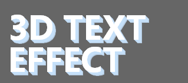

### CSS3小记

#### 1、CSS3简介
HMLT5、CSS3、ES6，已经趋向成熟，各大浏览器也对它们的语法也越来越兼容了，无疑HTML5能做出很多酷炫的效果，但CSS3带给我们的才是真正充满想象的视觉效果：旋转、缩放、二维和三维动画、动态和装饰性的文字效果、阴影、圆角和渐变填充，毫无疑问我对简简单单几行css代码就能做出以前需要javascript或gif图才能实现的效果很喜欢，难得有时间，整理一下以前用过的CSS3新属性、并系统地学习巩固一下CSS3的知识点。 <br>
CSS3已经分成了很多个模块而不是一份单独、完整的CSS3规范文档，主要有一下几个板块： <br>
* 媒体查询
* 选择器
* 字体文本效果
* 背景/边框
* 2D/3D转换
* 动画
* 布局
* 渐变/透明
使用CSS3之前，页面需要添加一行代码: <br>
```HTML
<name="viewport" content="width=device-width, initial-scale=1.0, maximum-scale=1.0, user-scalable=no">   
<!-- 
     width = device-width：宽度等于当前设备的宽度
     initial-scale： 初始的缩放比例（默认设置为1.0）
     minimum-scale：允许用户缩放到的最小比例（默认设置为1.0）
     maximum-scale：允许用户缩放到的最大比例（默认设置为1.0）
     user-scalable：用户是否可以手动缩放（默认设置为no，因为我们不希望用户放大缩小页面）
-->
```
并且对于不支持HTML5/CSS3 media的浏览器，可以借助使用Google的html5shiv包
```HTML
<!--[if lt IE9]> 
<script src="http://html5shiv.googlecode.com/svn/trunk/html5.js"></script>
<![endif]-->
```
#### 2、媒体查询
以前的一些网站打算为提供方便移动访问的版本， 很多时候会建立一个子域，使用不同于父站点的样式表和HTML模板，图片也不得不重新调整大小以适应移动设备的的小屏幕，另外还需要重新创建脚本，检测用户是否使用了移动浏览器，然后重定向到相应的移动站点上。毫无疑问这是需要大量的开发成本和维护成本的。<br>
媒体查询解决了这一问题，它们会基于设备的属性检测设备，这样就不用使用浏览器探测脚本，之后允许直接安装设备的功能去设定目标样式。 <br>
###### CCS2中的media
具体用法，就是在HTML页面的heaad标签中插入如下的一段代码,例如: <br>
```HTML
<link rel="stylesheet" type="text/css" media="screen and (max-width:960px)" href="style.css">  <!-- 让页面宽度小于960的执行指定的样式文件 -->
```
但这样的做法就会增加页面http的请求次数，增加了页面负担，所以CCS3样式都写在一个文件里面。
###### CSS3的 media
我们常用的CSS3参数是大小、等于、小于，但其实CSS3提供了很多参数： <br>
>width:浏览器可视宽度。  <br>
        height:浏览器可视高度。   <br>
        device-width:设备屏幕的宽度。   <br>
        device-height:设备屏幕的高度。   <br>
        orientation:检测设备目前处于横向还是纵向状态。   <br>
        aspect-ratio:检测浏览器可视宽度和高度的比例。(例如：aspect-ratio:16/9)   <br>
        device-aspect-ratio:检测设备的宽度和高度的比例。   <br>
        color:检测颜色的位数。（例如：min-color:32就会检测设备是否拥有32位颜色）   <br>
        color-index:检查设备颜色索引表中的颜色，他的值不能是负数。   <br>
        monochrome:检测单色楨缓冲区域中的每个像素的位数。（这个太高级，估计咱很少会用的到）   <br>
        resolution:检测屏幕或打印机的分辨率。(例如：min-resolution:300dpi或min-resolution:118dpcm)。   <br>
        grid:检测输出的设备是网格的还是位图设备。   <br>

例如： <br>
1）方向  <br>
orientation：有两个值可选，landscape（浏览器宽度大于高度时候被应用，浏览器默认值）、portrait（浏览器高度大于宽度时被使用）:
```CSS
/* 默认情况下，li元素横跨页面叠放起来，当orienttation:portrait（页面重新调整让其高度大于其宽度、在其具有纵向模式的设备中查看页面）浮动就被去掉，li元素垂直堆叠起来 */
ul { overfolw:hidden; }
li { float:left; }
@media only screen and (orienttation:portrait){
  li { float:none; }
}
```
2）像素比  <br>
在小屏幕上访问网站，通常需要放大显示，导致屏幕像素大于CSS像素，这对于位图格式图片，放大时会导致严重失真，现在很多手机使用更高像素密度比的屏幕，能够以高分辨率显示而没有任何失真。 <br>
媒体特征可以根据设备的像素密度去判断设备——device-pixel-ratio（在mobile webkit中带有前缀-webkit-） <br>
``CSS
/* 屏幕在标准（或是低分辨率）像素比设备的浏览器上将使用标准图片，像素比至少在1.5的设备则使用高分辨率的图片 */
E { background-image:url('lores.png'); }
@media screen and (-webkit-min-device-pixel-ratio:1.5){ 
  background-image:url('hires.png');
  background-size:100% 100%;
}
``
3） 多种媒体特性 <br>
and操作符添加样式，可以把多条查询链接在同一个媒体类型上，这种语法在应用选定规则之前，会先检测两个表达式是否匹配： <br>
```CSS
/* 16:9宽屏格式的小屏幕 */
@media only screen and (aspect-ratio:15/10) and (aspect-ratio:16/9) and (aspect-ratio:16/10){ rules } 
```


#### 3、选择器
选择器大体可以划分为两种，第一种是直接作用于文档树中定义的元素，包含类选择器、类型选择器、属性选择器；第二种是包含伪选择器，作用于文档树之外的元素或信息（比如说父元素的最后一个元素、段落中的第一个字母）。 <br>
##### 1)CSS3新属性选择器：
###### 开始子串属性值选择器  E[attr^ = 'value'] {}
```CSS
a[href^ = 'mailto']{ background-image:url('email_img.png'); }
a[href^ = 'ftp']{ background-image:url('folder_img.png'); }
a[href^ = 'https']{ background-image:url('lock_img.png'); }
``` 
###### 结束子串属性值选择器——选择以指定的值结束的属性   E[attr$ = 'value'] {}
```CSS
a[title$ = '.pdf']{ background-image:url('pdf_img.png'); }
a[title$ = '.doc']{ background-image:url('doc_img.png'); }
a[title$ = '.rss']{ background-image:url('feed_img.png'); }
``` 
###### 任意子串属性值选择器——在指定的属性字符串内部任意位置搜索指定的子串         E[attr* = 'value'] {}
```CSS
a[href* = '.pdf']{ background-image:url('pdf.png'); }
```
###### 多属性选择器——可以把多个选择器串联在一起
```CSS
/* 寻找这样一个a元素：具有一个href属性，是以http://开始，以.pdf结束，并且在中间包含了/floder2/ */
a[href^ = 'http://'][href* = '/folder2/'][href$ = '.pdf']{}
```
##### 2）普通兄弟连结符
```CSS
E + F {}  /* 相连兄弟连结符——文档树中的同一层级中，紧邻在元素E之后的任意元素F */
E ~ F {}  /* 普通兄弟连结符——文档树中的同一层级中，位于元素E之后的任意元素F */
```

##### 3）伪类
###### 结构伪类
```CSS
E:nth-*(even) {}        /* 相当于E:nth-*(2n){} 代表2的每一个倍数（2/4/6/8、、、、） */
E:nth-*(odd) {}         /* 相当于E:nth-*(2n+1){} 代表2的每一个倍数（1/3/5/7、、、、） */
E:nth-child(n) {}       /* 相当于 E:nth-of-type(n){} 简单地选择了属于类型E的所有子元素  */      
E:nth-child(2n) {}      /* 选择了类型E中所有处于偶数位的元素，计数的时候包括各种类型的兄弟元素 */
E:nth-of-type(2n) {}    /* 选择了E类型中所有处于偶数位的元素，但是在计数的时候只包含那些同类型的元素 */
E:nth-last-child(n){}   /* 选择器匹配属于其元素的第 N 个子元素的每个元素，不论元素的类型，从最后一个子元素开始计数 */
E:nth-last-of-type(n){} /* 选择器匹配属于父元素的特定类型的第 N 个子元素的每个元素，从最后一个子元素开始计数 */
E:first-of-type{}       /* 选择器匹配属于其父元素的特定类型的首个子元素的每个元素   p:first-of-type等同于p:nth-of-type(1)*/
E:last-child{}          /* 选择器匹配属于其父元素的最后一个子元素的每个元素  p:last-child等同于p:nth-last-child(1) */
E:last-of-type{}        /* 选择器匹配属于其父元素的特定类型的最后一个子元素的每个元素   p:last-of-type等同于p:nth-last-of-type(1) */
E:only-child{}          /* 选择器匹配属于其父元素的唯一子元素的每个元素 */
E:only-of-type{}        /* 选择器匹配属于其父元素的特定类型的唯一子元素的每个元素 */
```

##### 4)其他伪类
###### target伪类
target伪类是用来匹配文档(页面)的URI中某个标志符的目标元素。具体来说，URI中的标志符通常会包含一个”#”字符，然后后面带有一个标志符名称，比如#respond，target就是用来匹配ID为respond的元素的。 <br>
target伪类的出现让我们可以用纯CSS实现tab切换效果，例如：  <br>
```HTML
<div class="tablist">
    <ul class="tabmenu">
        <li><a href="#tab1">tab1</a></li>
        <li><a href="#tab2">tab2</a></li>
        <li><a href="#tab3">tab3</a></li>
    </ul>
    <div id="tab1" class="tab_content">tab1</div>
    <div id="tab2" class="tab_content">tab2tab2</div>
    <div id="tab3" class="tab_content">tab3tab3tab3</div>
</div>
```
```CSS
#tab1:target, #tab2:target, #tab3:target {     /* 先根据target的特性锚链接到对应的div,再根据z-index的属性，改变div的层级关系，从而实现tab的切换效果 */
        z-index: 1;
}  
```
###### empty伪类
E:empty伪类选择器匹配没有任何子元素（包括text节点）的元素
```HTML
<p><strong>有内容</strong></p>
<div class="box">有内容</div>
<p><strong>无内容淡色背景</strong></p>
<div class="box"></div>
<p><strong>空格也算内容</strong></p>
<div class="box"> </div>
<p><strong>伪元素不算内容</strong></p>
<div class="box pseudo"></div>
```
```css
.box { width: 256px; height: 90px; padding: 10px; background-color: #cd0000; color: #fff; }
.box:empty { opacity: .1; }
.pseudo::after { content: '伪元素生成内容'; }
```
###### root伪类
root伪类选择文档树中的第一个元素， 它唯一真正的作用就是发生在XML文档添加样式表的时候。同时它在HTML中使用root也有一个小作用——为html元素赋予特殊度，在需要覆盖简单类型选择器的时候很有用。
###### not伪类
否定选择器“:not”主要用于定位不匹配该选择器的元素。在统一设置元素样式时过滤不需要的元素。其最大的作用是在统一设置某个元素样式时可以排除部分特定的元素，简化CSS样式代码。
```css
p{ font-style:italic; }
p:first-child{ font-style:normal; }
/* :not伪类可以把上诉两行代码简化成下面一行代码 */
p:not(:first-child){ font-style:italic; }     /* 传入not伪类的参数必须是一个简单的选择器，连结符（如+和>）以及伪类元素都是没效的 */
```
###### UI元素状态伪类
这种伪类的特点是指定的样式只有当元素处于某种状态时才起作用，在默认状态下不起作用。具体有：
```CSS
E:hover | E:active | E:focus | E:enable | E:disable
E:read-only | E:read-write | E:checked | E:default
E:indeterminate | E::selection | E:valid | E:invalid
E:required | E:optional | E:in-range
```
详细介绍可参考 [CSS3--UI元素状态伪类选择器](http://www.jianshu.com/p/69371a97d142)

##### 5)伪元素
很多时候我会把伪类和伪元素搞混，伪元素提供的也是在文档树中没有具体指明的信息，伪类利用的是一些“虚幻”的条件，比如元素在文档中的位置或元素的状态，伪元素则走得更远，它可以把样式应用到文档树中根本就不存在的元素上。 <br>
伪类用于当已有元素处于的某个状态时，为其添加对应的样式，这个状态是根据用户行为而动态变化的。比如说，当用户悬停在指定的元素时，我们可以通过:hover来描述这个元素的状态。虽然它和普通的css类相似，可以为已有的元素添加样式，但是它只有处于dom树无法描述的状态下才能为元素添加样式，所以将其称为伪类。 <br>
伪元素用于创建一些不在文档树中的元素，并为其添加样式。比如说，我们可以通过:before来在一个元素前增加一些文本，并为这些文本添加样式。虽然用户可以看到这些文本，但是这些文本实际上不在文档树中。 <br>
     <br>
虽然CSS3标准要求伪元素使用双冒号的写法，但也依然支持单冒号的写法。
```CSS
E::before{}       /* :before在被选元素前插入内容。需要使用content属性来指定要插入的内容。被插入的内容实际上不在文档树中。 */      
E::after{}        /* :after在被元素后插入内容，其用法和特性与:before相似。 */
E::first{}        /* :first-letter匹配元素中文本的首字母。被修饰的首字母不在文档树中。 */
E::first-line{}   /* first-line匹配元素中第一行的文本。这个伪元素只能用在块元素中，不能用在内联元素中 */
E::selection{}    /* ::selection匹配用户被用户选中或者处于高亮状态的部分。在火狐浏览器使用时需要添加-moz前缀。该伪元素只支持双冒号的形式。 */
E:::placeholder{} /* ::placeholder匹配占位符的文本，只有元素设置了placeholder属性时，该伪元素才能生效。并且该伪元素不是CSS的标准，将来可能会改善，所以使用时需谨慎 */
E::backdrop{}     /* ::backdrop用于改变全屏模式下的背景颜色，全屏模式的默认颜色为黑色。该伪元素只支持双冒号的形式,并且处于试验阶段 */
```

#### 4、字体文本效果
##### 1）@font-face——把自己定义的Web字体嵌入到网页
要在页面上显示网页（或者非系统）字体，需要使用@font-face规则——该规则对字体进行了定义，并且为浏览器提供了文件的使用位置，基本语法如下: <br>
```CSS
@font-face {
      font-family: <YourWebFontName>;    /* font-family指的就是你自定义的字体名称，最好是使用下载的默认字体，它将被引用到Web元素中的font-family。 */
      src: <source> [<format>][,<source> [<format>]]*;   /* source:自定义的字体的存放路径，可以是相对路径也可以是绝路径;format:自定义的字体的格式，主要用来帮助浏览器识别，其值主要有以下几种类型：truetype,opentype,truetype-aat,embedded-opentype,avg等； */
      [font-weight: <weight>];  
      [font-style: <style>];
    }
```
为了让更多的浏览器支持，可以用以下代码模板： <br>
```CSS
@font-face {
	font-family: 'YourWebFontName';
	src: url('YourWebFontName.eot'); /* IE9 Compat Modes */
	src: url('YourWebFontName.eot?#iefix') format('embedded-opentype'), /* IE6-IE8 */
             url('YourWebFontName.woff') format('woff'), /* Modern Browsers */
             url('YourWebFontName.ttf')  format('truetype'), /* Safari, Android, iOS */
             url('YourWebFontName.svg#YourWebFontName') format('svg'); /* Legacy iOS */
   }
```
但是问题是特殊字体我要怎样才能得到，那些.eot,.woff,.ttf,.svg这些字体格式又怎么获取呢？  <br>
###### 获取字体
途径一是找到付费网站购买字体，二就是到免费网站DownLoad字体，这里推荐[Google Web Fonts](https://fonts.google.com/)和[Dafont.com](http://www.dafont.com/)download免费字体，下载到电脑后解压即可。
###### 获取@font-face所需字体格式
获得@font-face所需的.eot,.woff,.ttf,.svg字体格式需要第三方工具,推荐 [fontsquirrel](https://www.fontsquirrel.com/tools/webfont-generator)，操作一遍基本上就会了，解压出来的字体格式就是@font-face所需字体格式了。
###### 使用
在项目文件夹下面可以新建一个fonts文件夹，存放@font-face字体格式，然后再common.css中引入以下css代码：
```CSS
@font-face {
      font-family: 'SingleMaltaRegular';
      src: url('../fonts/singlemalta-webfont.eot');
      src: url('../fonts/singlemalta-webfont.eot?#iefix') format('embedded-opentype'),
           url('../fonts/singlemalta-webfont.woff') format('woff'),
	   url('../fonts/singlemalta-webfont.ttf') format('truetype'),
	   url('../fonts/singlemalta-webfont.svg#SingleMaltaRegular') format('svg');
      font-weight: normal;
      font-style: normal;
   }
```
现在已经通过@font-face自定义好所需的SingleMalta字体，只需要把自己定义的字体应用到你的Web中的DOM元素上就可以了： 
```css
p.singleMalta {
     font-family: 'SingleMaltaRegular'
   }
```
##### 2）文本效果
###### 应用空间效果text-shadow
以前没有text-shadow出现的时候，网页上的阴影效果很多都是通过photoshop实现的，现在可以直接使用text-shadow属性来指定阴影。这个属性可以有两个作用，产生阴影和模糊主体。这样在不使用图片时能给文字增加质感。 <br>
```CSS
text-shadow: X-Offset Y-Offset Blur Color;   
/* 
     X-Offset表示阴影的水平偏移距离，其值为正值时阴影向右偏移，如果其值为负值时，阴影向左偏移;
     Y-Offset是指阴影的垂直偏移距离，如果其值是正值时，阴影向下偏移反之其值是负值时阴影向顶部偏移;
     Blur是指阴影的模糊程度，其值不能是负值，如果值越大，阴影越模糊，反之阴影越清晰，如果不需要阴影模糊可以将Blur值设置为0；
     Color是指阴影的颜色，可使用rgba色
*/
```
text-shadow并不局限于单一阴影，它的语法为文本节点添加多重阴影，只需要为该属性提供几个附加的值，使用逗号隔开进行分隔,阴影就会按提供的值的顺序被应用。例如：  <br>
```CSS
.demo {
      background: #666666;
      width: 440px;
      padding: 30px;
      font: bold 55px/100% "微软雅黑", "Lucida Grande", "Lucida Sans", Helvetica, Arial, Sans;;
      color: #fff;
      text-transform: uppercase;
  }
.demo1 {
  color: #fff;
  text-shadow: 1px 1px rgba(197, 223, 248,0.8),
               2px 2px rgba(197, 223, 248,0.8),
               3px 3px rgba(197, 223, 248,0.8),
               4px 4px rgba(197, 223, 248,0.8),
               5px 5px rgba(197, 223, 248,0.8),
               6px 6px rgba(197, 223, 248,0.8);
}
```

###### 让文本变得更清晰：text-outline 和 text-stroke
CSS3提供了text-outline来更好地控制轮廓:text-outline和 text-stroke
```CSS
E { text-outline:thickness  blur-radius color; }   
/* 
	thickness：轮廓的粗细
	blur-radius：轮廓的模糊半径
	color：轮廓的颜色
*/
```
但是所有主流的浏览器都不支持text-outline，但webkit浏览器提供了类似的东西——text-stroke
```CSS
E{
	-webkit-text-fill-color:color;
	-webkit-text-stroke-color:color;
	-webkit-text-stroke-width:length;
	-webkit-text-stroke:stroke-width stroke-color;    /* 简写属性，宽度和颜色 */
}
```
###### 限制溢出
CSS3 提供了 text-overflow 属性来控制文本的溢出部分，它的作用是对溢出的部分裁剪掉，然后判定是否添加省略号。text-overflow的默认值是clip，裁剪文本时不添加“...”省略号；值为ellipsis时，表示裁剪文本时添加“...”省略号；值为string时，表示使用给定的字符串来代表被修剪的文本。
```HTML
<p>如果您把光标移动到下面两个 div 上，就能够看到全部文本。</p>
<p>这个 div 使用 "text-overflow:ellipsis" ：</p>
<div class="test" style="text-overflow:ellipsis;">This is some long text that will not fit in the box</div>
<p>这个 div 使用 "text-overflow:clip"：</p>
<div class="test" style="text-overflow:clip;">This is some long text that will not fit in the box</div>
```
```CSS
div.test
{
white-space:nowrap; 
width:12em; 
overflow:hidden; 
border:1px solid #000000;
}

div.test:hover
{
text-overflow:inherit;
overflow:visible;
}
```
###### 改变元素大小
resize 属性规定是否可由用户调整元素的尺寸,如果希望此属性生效，需要设置元素的 overflow 属性，值可以是 auto、hidden 或 scroll.
```CSS
resize: none|both|horizontal|vertical;
/* 
	none:用户无法调整元素的尺寸
	both:用户可调整元素的高度和宽度
	horizontal:用户可调整元素的宽度
	vertical:用户可调整元素的高度
*/
```
###### 文本对齐
在做表单时我们经常遇到让上下两个字段对齐的情况，比如姓名， 手机号码， 出生地。这样我们就要用到 text-align， text-justify样式了。 <br>
text-align直接设为justify就行了，而text-justify的取值有几种可能： <br>
* auto :允许浏览器用户代理确定使用的两端对齐法则
* inter-word :通过增加字之间的空格对齐文本。该行为是对齐所有文本行最快的方法。它的两端对齐行为对段落的最后一行无效
* newspaper : 通过增加或减少字或字母之间的空格对齐文本。是用于拉丁文字母表两端对齐的最精确格式
* distribute :处理空格很像newspaper，适用于东亚文档。尤其是泰国
* distribute-all-lines :两端对齐行的方式与distribute相同，也同样不包含两段对齐段落的最后一行。适用于表意字文档
* inter-ideograph : 为表意字文本提供完全两端对齐。他增加或减少表意字和词间的空格
```HTML
	<div class="box1">
            <div class="test1">姓 名</div>
            <div class="test1">姓 名 姓 名</div>
            <div class="test1">姓 名 名</div>
            <div class="test1">所 在 地</div>
            <div class="test1">工 作 单 位</div>
        </div>
```
```css
	.box1{
                background:red;
                width:30%;
            }
            .test1 {
                text-align:justify;
                text-justify:distribute-all-lines;/*ie6-8*/
                text-align-last:justify;/* ie9*/
                -moz-text-align-last:justify;/*ff*/
                -webkit-text-align-last:justify;/*chrome 20+*/
            }
            @media screen and (-webkit-min-device-pixel-ratio:0){/* chrome*/
                .test1:after{
                    content:".";
                    display: inline-block;
                    width:100%;
                    overflow:hidden;
                    height:0;
                }
            }
```
运行效果是： 

###### 文本换行
word-wrap:指定了浏览器是否可以把长单句折断，使其容纳在父元素中。值为normal表示指定文本行只能在两个单词之间折断（除非在标记中另有指定）；值为break-word表示允许单词在需要防止溢出父元素的时候折断。
white-space：声明建立布局过程中如何处理元素中的空白符。可能的值有：
* normal:默认，忽略空白符，忽略原有换行符。自动换行，不会有滚动条
* pre:保留空白符；保留换行符，即保留原有格式
* nowrap:忽略空白符，文本不换行，直到遇到</br>；
* pre-wrap:保留空白符，自动进行换行，不会有滚动条
* pre-line:合并空白符，保留换行符；
word-break:break-all和word-wrap:break-word都是能使其容器如DIV的内容自动换行。 <br>
但是word- break:break-all 例如div宽200px，它的内容就会到200px自动换行，如果该行末端有个英文单词很长（congratulation等），它会把单词截断，变成该 行末端为conra(congratulation的前端部分)，下一行为tulation（conguatulation）的后端部分了。 <br>
而word-wrap:break-word 例子与上面一样，但区别就是它会把congratulation整个单词看成一个整体，如果该行末端宽度不够显示整个单词，它会自动把整个单词放到下一行，而不会把单词截断掉的。

######  应用标点属性
有时候我们喜欢把标点固定到文本块的页边空白处，此时就需要在text-indent上设置一个负值。  <br>
text-indent 属性规定文本块中首行文本的缩进,如果使用负值，那么首行会被缩进到左边.。


