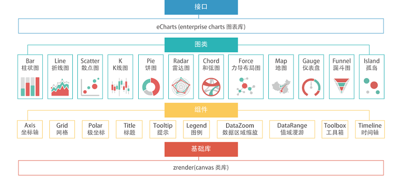
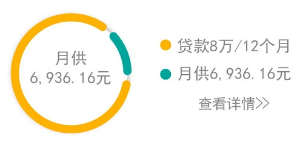
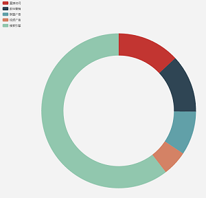

###### ECharts画圆使用小结

[ECharts](http://echarts.baidu.com/)开源来自百度商业前端数据可视化团队，基于html5 Canvas，是一个纯Javascript图表库，提供直观，生动，可交互，可个性化定制的数据可视化图表。 <br>
用一张图来了解ECharts：   <br>
   <br> 
<br> 
<br> 
设计师给的图是： 


参考官方实例，最像设计图的就是    （或者点击[这里](http://echarts.baidu.com/demo.html#pie-doughnut) ） <br>

但是可以看出设计图的每一项之间是有一定的空白间隔的，而且图例组件显示的数据不单纯只是data的数值，还有就是控制饼图的每一项位置是在饼图的右方。  <br>
所以我们接下来就来对照ECharts [配置项手册](http://echarts.baidu.com/option.html#title) 来做出我们想要的饼图  <br>

首先要在html中添加如下代码：
```html
<div id="ECharts"></div>
```
##### 初始化echarts实例
```javascript
var loanChart = document.getElementById("ECharts");
```
##### 指定图表的配置项和数据

```javascript
  var createChart = function(data){
  var chart = echarts.init(loanChart);
  // 这里开始可以配置各项属性
  // 首先看一下  图形样式
  var dataStyle = {
				normal: {
				   label: {
				       show: false
				   },
				   labelLine: {
				       show: false
				   },
				   borderWidth: 10,
				   borderColor: '#ffffff',	       
			}
	};
  var option = {
      series: [{
          itemStyle: dataStyle,
      }]
  }
}
```
```javascript
// 图例组件  
var option = {
    legend:{ 
        orient: 'vertical',
        left: '60%',                // 图例组件离容器左侧的距离                  
        top: '30%',                 // 图例组件离容器上侧的距离                    
        itemWidth: 8,              // 图例标记的图形宽度          
        itemHeight: 8,
    },
    series: [{  }]
```
```javascript
// 数据
// 在createChart方法外虚拟一组数据
var data = { "total":80000.00,"month":12,"per":6936.16,"unit":8 };
// createChart方法内数据调用
var option = {
    legend: {
        data: ['贷款' + data.unit +'万/' + data.month + '个月','月供' + data.per + '元'],
    },
    series: [{
        data: [{
				      value: data.total,
				      name:  '贷款' + data.unit +'万/' + data.month + '个月'
				 }, {
				      value: data.per,
				      name:  '月供' + data.per + '元'
				 }]
    }]
}
```
##### 使用刚指定的配置项和数据显示图表
```javascript
chart.setOption(option);
```
###### 完整的js代码
```javascript
     		var data = { "total":80000.00,"month":12,"per":6936.16,"unit":8 };
 			
 			// 初始化echarts实例
 			var loanChart = document.getElementById("ECharts");
 			// 指定图表的配置项和数据
 			var createChart = function(data){
 				console.log(data);
 				var chart = echarts.init(loanChart);
 				var dataStyle = {
				    normal: {
				        label: {
				            show: false
				        },
				        labelLine: {
				            show: false
				        },
				        borderWidth: 10,
				        borderColor: '#ffffff',	       
				    }
				};
 				var option = {
 					backgroundColor: '#ffffff',
				    color: ['#FDB225', '#16A59C'],
				    tooltip: { },
				    legend: {     // 饼图外的各项数据item
				        orient: 'vertical',
				        left: '60%',
				        top: '30%',
				        itemWidth: 8,
				        itemHeight: 8,
				        data: ['贷款' + data.unit +'万/' + data.month + '个月','月供' + data.per + '元'],
				    },
				    series: [{    // 饼图的属性配置
				        name: '查悦安心贷',
				        type: 'pie',
				        center: ['30%','50%'],
				        radius: ['50%', '70%'],
				        avoidLabelOverlap: false,
				        startAngle:20,
				        itemStyle: dataStyle,    // 图形样式
				        label: {
				            normal: {
				                show: false,
				                position: 'center'
				            },
				            emphasis: {
				                show: true,
				                formatter: function(param) {
				                	return param.name;
				                },
				                textStyle: {
				                    fontSize: '16',
				                    fontWeight: 'bold'
				                }
				            }
				        },
				        labelLine: {
				            normal: {
				                show: true
				            }
				        },
				        data: [{
				            value: data.total,
				            name:  '贷款' + data.unit +'万/' + data.month + '个月'
				        }, {
				            value: data.per,
				            name:  '月供' + data.per + '元'
				        }]
				    }]
 				};
 				// 使用刚指定的配置项和数据显示图表
 				chart.setOption(option);
 			};
 			createChart(data);
```
