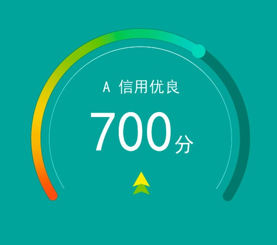

### Canvas 画圆形百分比进度条
首先来看一下设计师给的设计图：   <br>
   <br>
    设计图由三部分构成：底部圆弧环（深灰色的圆弧环背景） + 彩色的进度条 + 中间的文字。其中彩色进度条为颜色的渐变。


###### 先上HTML代码
```html
<div class="creditRating">
		<canvas class="arcBar" id="rating" width="300" height="260"></canvas>
		<div class="creditScore">
				<p><span class="grade">A</span><span class="status">信用优良</span></p>
				<p><span class="value">700</span>分</p>
				<p></p>
		</div>
</div>
```
    <canvas> 标签只有两个属性—— width和height。这些都是可选的，并且同样利用 DOM properties 来设置。
    当没有设置宽度和高度的时候，canvas会初始化宽度为300像素和高度为150像素。
    该元素可以使用CSS来定义大小，但在绘制时图像会伸缩以适应它的框架尺寸：如果CSS的尺寸与初始画布的比例不一致，它会出现扭曲。

###### css 主要是对圆弧环内的文字设计样式，不详述了。
###### js代码
首先，获取到该canvas元素，然后创建2d画布，并创建一些属性来控制变量：
```javascript
var canvas = document.getElementById("rating"),
    ctx = canvas.getContext("2d"),
    percent = 85.0, // 最终百分比
    circleX = canvas.width / 2, // 中心x坐标
    circleY = canvas.height / 2, // 中心y坐标
    radius = 120, // 圆环半径
    lineWidth = 10, // 圆形线条的宽度
    fontSize = 50; // 字体大小
```
接下来画弧圆
```javascript
function circle(cx, cy, r) {
    ctx.beginPath();
    ctx.lineWidth = lineWidth;         
    ctx.strokeStyle = '#0C786C';       
    ctx.arc(cx, cy, r, Math.PI * 0.75, Math.PI * 2.25);
    ctx.stroke();
}
```
   ctx.closePath(); 可以设置闭合的线条
  lineWidth 是指线条的宽度；
  strokeStyle 是指最后画线条时渲染线条的颜色；
  Math.PI 是指半个圆的圆弧长，Math.PI * 0.75 则为第四象限的45°角。 
  arc (x, y, r, start, end, anticlockwise) 其中 x,y 是圆心坐标，r 是半径，start 是起始角度，end 是结束角度，最后一个属性是布尔值－是否逆时针画（默认false）

接着画里面的弧线
```javascript
function circleLine(cx, cy) {
	  var R = 105;
    ctx.beginPath();
    ctx.lineWidth = 1;
    ctx.strokeStyle = '#C2F4F4';
    ctx.arc(cx, cy, R, Math.PI * 0.75, Math.PI * 2.25);
    ctx.stroke();
}
```

再画进度条——圆弧环
```javascript
function sector(cx, cy, r, startAngle, endAngle, anti) {
    ctx.beginPath();
    ctx.lineWidth = lineWidth;

    // 渐变色 - 可自定义
    var linGrad = ctx.createLinearGradient(
        circleX, circleY - radius - lineWidth, circleX, circleY + radius + lineWidth
    );
    linGrad.addColorStop(0.00, '#1FD8B9');     // 绿色
    linGrad.addColorStop(0.30, '#FAED30');     // 黄色
    linGrad.addColorStop(0.40, '#F8C828');     // 橙色
    linGrad.addColorStop(0.50, '#FAED30');     // 黄色
    linGrad.addColorStop(0.80, '#FA4C20');     // 橙色
    linGrad.addColorStop(1.00, '#15A49B');     // 红色
    ctx.strokeStyle = linGrad;

    // 圆弧两端的样式
    ctx.lineCap = 'round';

    // 圆弧
    ctx.arc(cx,cy,r,startAngle,endAngle * (Math.PI / 180.0) + Math.PI * 0.75)
    ctx.stroke();
}
```
  createLinearGradient(x0,y0,x1,y1) 是创建线性渐变，其中 x0,y0 是指线性渐变起始坐标，x1,y1 是终止坐标；
  addColorStop 是添加渐变的点
当控制变量的属性改变的额时候，重新画圆
```javascript
function loading() {
    if (process >= percent) {
        clearInterval(circleLoading);
    }

    // 清除canvas内容
    ctx.clearRect(0, 0, circleX * 2, circleY * 2);

    // 弧圆
    circle(circleX, circleY, radius);
    
    // 里面的弧线
    circleLine(circleX, circleY, radius);

    // 圆弧
    sector(circleX, circleY, radius, Math.PI * 0.75, process / 100 * 270);

    // 控制结束时动画的速度
    if (process / percent > 0.90) {
        process += 0.30;
    } else if (process / percent > 0.80) {
        process += 0.55;
    } else if (process / percent > 0.70) {
        process += 0.75;
    } else {
        process += 1.0;
    }
}
```
  clearReck(x0,y0,x1,y1) 清除矩形（x0,y0 矩形左上角起始坐标，x1,y1 矩形右下角结束坐标）中的所有内容，每次刷新的时候需要清除之前绘制的效果； <br>
  
可以点击[这里](http://codepen.io/minyillee/pen/yVZdOj)查看效果
